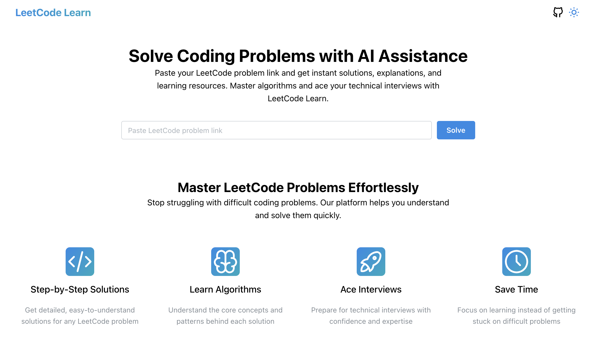

<div align="center">
  
  <h1>LeetCode Learn</h1>
  <p>An AI-powered platform for solving LeetCode problems with detailed explanations and optimized solutions</p>
</div>

<div align="center">

[](https://vercel.com/new/clone?repository-url=https%3A%2F%2Fgithub.com%2FQuocVietHa08%2Fleet-code-learn)
[](https://github.com/QuocVietHa08/leet-code-learn/stargazers)
[](https://github.com/QuocVietHa08/leet-code-learn/blob/main/LICENSE)

</div>

## 🚀 Features

- **Problem Retrieval**: Dynamically fetch LeetCode problems using the problem URL
- **AI-Assisted Solutions**: Get both brute force and optimized solutions with detailed explanations
- **Markdown Rendering**: Clean display of problem descriptions with proper formatting for code blocks, examples, and constraints
- **Dark Mode Support**: Fully responsive UI with light and dark mode themes
- **Skeleton Loading**: Enhanced user experience with skeleton loading states
- **Mobile Responsive**: Optimized layout for all device sizes

## 📋 Requirements

- Node.js 18.18.0 or higher
- npm or yarn

## 🛠️ Tech Stack

- **Framework**: [Next.js 15.2.3](https://nextjs.org/)
- **UI Library**: [Mantine 7.17.4](https://mantine.dev/)
- **Styling**: [TailwindCSS](https://tailwindcss.com/)
- **API Integration**: [@codingsnack/leetcode-api](https://www.npmjs.com/package/@codingsnack/leetcode-api)
- **Markdown Rendering**: [react-markdown](https://github.com/remarkjs/react-markdown) with rehype plugins
- **Icons**: [Tabler Icons](https://tabler-icons.io/)
- **Analytics**: [Vercel Analytics](https://vercel.com/analytics)

## 🚀 Getting Started

### Installation

```bash
# Clone the repository
git clone https://github.com/QuocVietHa08/leet-code-learn.git
cd leet-code-learn

# Install dependencies
npm install
# or
yarn install
```

### Development

```bash
# Start the development server
npm run dev
# or
yarn dev
```

Open [http://localhost:3000](http://localhost:3000) in your browser to see the application.

### Building for Production

```bash
# Build the application
npm run build
# or
yarn build

# Start the production server
npm start
# or
yarn start
```

## 🔧 Environment Variables

Create a `.env.local` file in the root directory with the following variables:

```env
# LeetCode API credentials (optional)
LEETCODE_CSRF_TOKEN=your_csrf_token
LEETCODE_SESSION=your_session_token

# OpenAI API key (for solution generation)
OPENAI_API_KEY=your_openai_api_key
```

## 📝 Usage

1. Enter a LeetCode problem URL in the input field on the home page
2. Click "Solve" to fetch the problem details and generate solutions
3. Review the problem description and both brute force and optimized solutions
4. Toggle between light and dark mode using the theme selector in the header

## 🤝 Contributing

Contributions are welcome! Here's how you can contribute:

1. Fork the repository
2. Create a new branch (`git checkout -b feature/amazing-feature`)
3. Make your changes
4. Commit your changes (`git commit -m 'Add some amazing feature'`)
5. Push to the branch (`git push origin feature/amazing-feature`)
6. Open a Pull Request

Please make sure to update tests as appropriate and follow the code style of the project.

## 📄 License

This project is licensed under the MIT License - see the [LICENSE](LICENSE) file for details.

## 👨‍💻 Author

- [Edward Ha (QuocVietHa08)](https://www.linkedin.com/in/viethadev/) - Creator and maintainer

## 🙏 Acknowledgements

- [LeetCode](https://leetcode.com/) for providing the programming problems
- [OpenAI](https://openai.com/) for the AI solution generation capabilities
- [Vercel](https://vercel.com/) for hosting the application
- `prettier:write` – formats all files with Prettier
